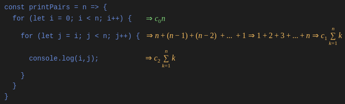
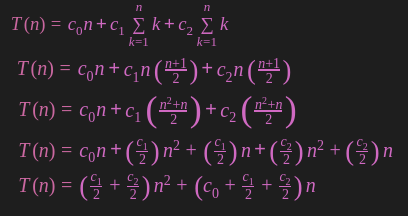
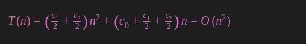

# Algorithm Complexity

The performance of the algorithm can be measured in two factors:

**Time complexity:** The amount of time required to complete the execution.

The time complexity of an algorithm is denoted by the ```big O notation```. Here, ```big O notation``` is the asymptotic notation to represent the time complexity.

The time complexity is mainly calculated by counting the number of steps to finish the execution. 

**Space complexity:** The amount of space required to solve a problem and produce an output.

Similar to the time complexity, space complexity is also expressed in ```big O notation```.

## How to analysis

- count time for each line

- sum all times

Assume the time is ```c```





We want to simplify it more.

### Reduction Rules

1. ignore constants

2. ignore lower bounds


