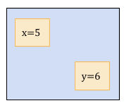
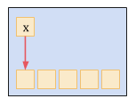
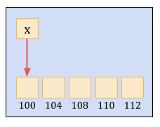

# Arrays

## Variables

A place in memory to store data in.

```
x = 5
y = 6
```


In computer programming, the most of the cases requires to store the large number of data of similar type. To store such amount of data, we need to define a large number of variables. It would be very difficult to remember names of all the variables while writing the programs. Instead of naming all the variables with a different name, it is better to define an **array** and store all the elements into it.

## Array

Linear Data Structure that stores data at contiguous memory locations.

- ```x``` is array of ```5``` elements
- ```x = address of first element```



- Array is the simplest data structure where each data element can be randomly accessed by using its index number.
- For example, if we want to store the marks of a student in ```6``` subjects, then we don't need to define different variable for the marks in different subject. instead of that, we can define an array which can store the marks in each subject at a the contiguous memory locations.
The array marks```[10]``` defines the marks of the student in ```10``` different subjects where each subject marks are located at a particular subscript in the array i.e. ```marks[0]``` denotes the marks in first subject, ```marks[1]``` denotes the marks in second subject and so on.

#### How Memory is Addressed?

Most of the RAMs are “byte addressable”. That means, each byte in the memory has an address.

#### How many bytes is the element?

The element takes a certain number of bytes according to the type of data that we want to store in the element.

```
char = 1 byte
int = 4 byte
float = 4 byte
double = 8 byte
```

```x is array of 5 int elements```



## Accessing Elements of an array

Each element takes ```n``` bytes ```(n = 1,2,3,…….)```

```x = address of first element```

```
address(x[0]) = x
address(x[1]) = x + n
address(x[2]) = x + 2*n
address(x[3]) = x + 3*n
address(x[4]) = x + 4*n
address(x[i]) = x + i*n
```
