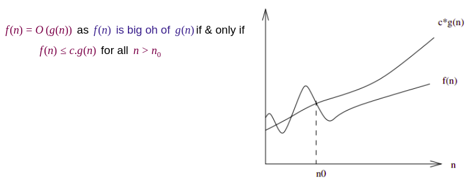
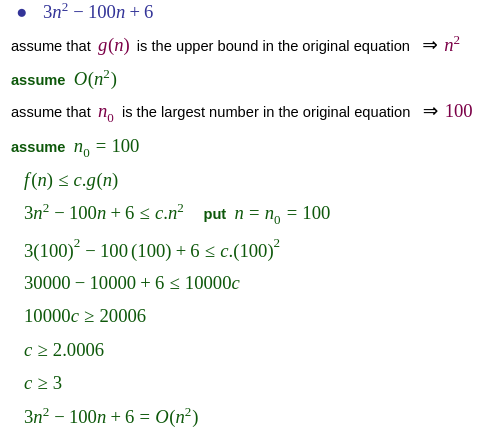
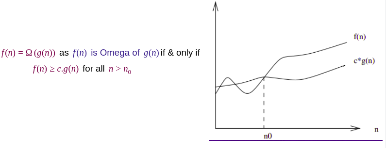
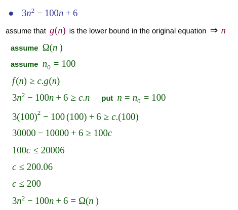
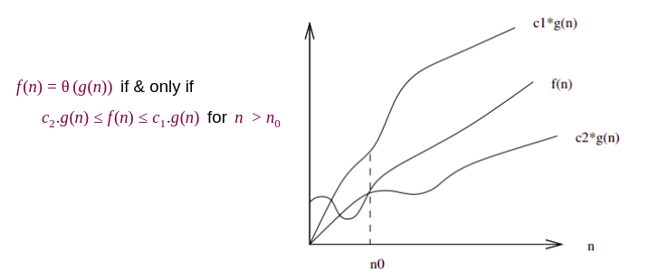
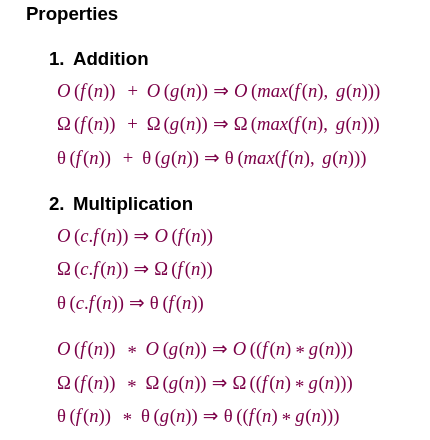
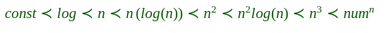
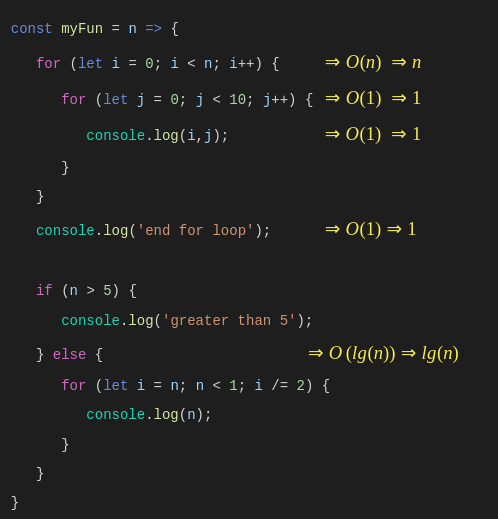
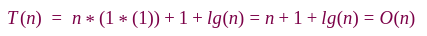

# Asymptotic Analysis

As we know that data structure is a way of organizing the data efficiently and that efficiency is measured either in terms of **time** or **space**. So, the ideal data structure is a structure that occupies the least possible time to perform all its operation and the memory space. Our focus would be on finding the **time complexity** rather than space complexity, and by finding the time complexity, we can decide which data structure is the best for an algorithm.

The main question arises in our mind that on what basis should we compare the time complexity of data structures?. The time complexity can be compared based on operations performed on them.

### How to find the Time Complexity or running time for performing the operations?

The running time to perform any operation depends on the size of the input. Let's understand this statement through a simple example.

Suppose we have an array of five elements, and we want to add a new element at the beginning of the array. To achieve this, we need to shift each element towards right, and suppose each element takes one unit of time. There are five elements, so five units of time would be taken. Suppose there are 1000 elements in an array, then it takes 1000 units of time to shift. It concludes that time complexity depends upon the input size.

Therefore, if the input size is ```n```, then ```f(n)``` is a function of ```n``` that denotes the time complexity.

The time required by an algorithm comes under three types:

**Worst case:** It defines the input for which the algorithm takes a huge time.

**Average case:** It takes average time for the program execution.

**Best case:** It defines the input for which the algorithm takes the lowest time

## Asymptotic Notations

A way to simplify the function.

The commonly used asymptotic notations used for calculating the running time complexity of an algorithm is given below:

### 1. Big oh Notation (O) - Upper Bound

This notation provides an upper bound on a function which ensures that the function never grows faster than the upper bound.

It is the formal way to express the upper boundary of an algorithm running time. It measures the worst case of time complexity or the algorithm's longest amount of time to complete its operation.

###### For example:

If **```f(n)```** and **```g(n)```** are the two functions defined for positive integers,then 



This implies that **```f(n)```** does not grow faster than **```g(n)```**, or g(n)**```g(n)```** is an upper bound on the function **```f(n)```**. In this case, we are calculating the growth rate of the function which eventually calculates the **worst time complexity of a function**, i.e., how worst an algorithm can perform.

###### Example:



### 2. Omega Notation (Ω) - Lower Bound

- It basically describes the best-case scenario which is opposite to the ```big o notation```.

- It is the formal way to represent the lower bound of an algorithm's running time. It measures the best amount of time an algorithm can possibly take to complete or **the best-case time complexity**.

- It determines what is the fastest time that an algorithm can run.

If **```f(n)```** and **```g(n)```** are the two functions defined for positive integers,then 



###### Example:



### 3. Theta Notation (θ) - Tight Bound

- The ```theta notation``` mainly describes the **average case** scenarios.

- It represents the realistic time complexity of an algorithm. Every time, an algorithm does not perform worst or best, in real-world problems, algorithms mainly fluctuate between the worst-case and best-case, and this gives us the average case of the algorithm.

- It is the formal way to express both the upper bound and lower bound of an algorithm running time.







## Analysis in simple way

### Operation 

- Doesn’t depend on input number.

- Take a constant time at any number of ```n```.

- Has **```O(1)```** time complexity.

It means execution time of the algorithm does not depend on the size of the input. Its execution time is constant, so that as you increase size of the problem very large, the execution time ultimately remains the same.

For example if you want to get the first element in an array. It doesn't matter how many elements are there in array, the complexity of this operation will always be of **```O(1)```**.

### Loop

Time Complexity of a loop is considered as **```O(n)```** if the loop variables is **incremented** / **decremented** by a **constant amount**.

For example following loop has **```O(n)```** time complexity, because the loop will be repeated ```n``` times.

```js
for (let i = 0; i < n; i += 1) {
   // any code here
}
```

But here in the example below, the loop will be repeated ```once```. if ```n = 10``` then the loop will be repeated once, and also if ```n = 20``` then the loop will be repeated once. So it has **```O(1)```** time complexity.

```js
for (let i = 0; i < n; i += n) {
   // any code here
}
```

And in the example below, The loop will be repeated 10 times, and the value of ```n``` does not matter.

```js
for (let i = 0; i < 10; i += 1) {
   // any code here
}
```

Time Complexity of a loop is considered as **```O(Logn)```** if the loop variables is **divided** / **multiplied** by a **constant amount**.

For example following loop has **```O(Logn)```**  time complexity.

```js
for (let i = n; i > 0; i /= 2) {
   // any code here
}
```

### Condition

- We need to consider worst case. We evaluate the situation when values in if-else conditions cause maximum number of statements to be executed.

- Take the time of the greatest condition.



###### Example




