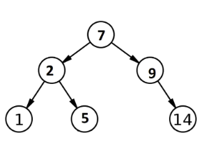
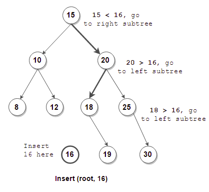
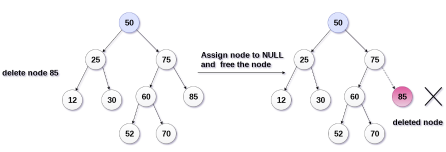
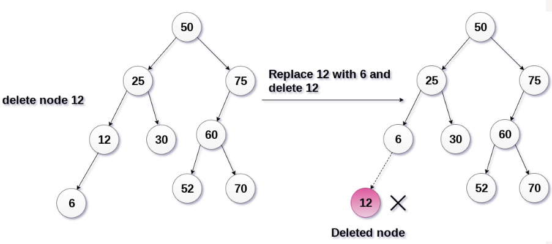
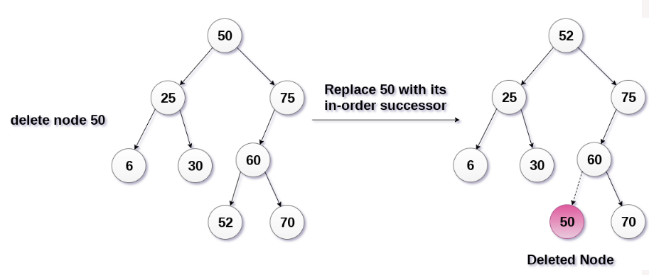

# Binary Search Tree

## Binary Search

We explained a [binary search](https://github.com/rehabas/Algorithms-Data-Structure/blob/main/Searching%20Algorithms.md#binary-search) earlier and reached to below algorithm.

```
go to middle
         if middle == target
            return index
         if middle > target
            search in left side
         if middle < target
            search in right side
```

## What is a Binary Search Tree ?

- Binary Search tree can be defined as a class of binary trees, in which the nodes are arranged in a specific order. This is also called ordered binary tree.
- In a binary search tree, the value of all the nodes in the **left** sub-tree is **less** than the value of the root.
- Similarly, value of all the nodes in the **right** sub-tree is **greater than or equal** to the value of the root.
- This rule will be recursively applied to all the left and right sub-trees of the root.



A Binary search tree is shown in the above figure, we can see that the root node ```7``` doesn't contain any value greater than or equal to ```7``` in its left sub-tree and it also doesn't contain any value less than ```7``` in its right sub-tree.

### Insertion

1. Start from the root. 
2. Compare the inserting element with root, if less than root, then recurse for left, else recurse for right. 
3. After reaching the end, just insert that node at left(if less than current) else right. 



###### Algorithm:

```
current = root
if value < current
	if current has left
		current = current.left
	else
		current.left = value
else
	if current has right
		current = current.right
	else
		current.right = value
repeat until inserted
```

### Deletion

There are three situations of deleting a node from binary search tree.

#### 1. The node to be deleted is a leaf node

It is the simplest case, in this case, replace the leaf node with the ```NULL``` and simple free the allocated space.

In the following image, we are deleting the node ```85```, since the node is a leaf node, therefore the node will be replaced with ```NULL``` and allocated space will be freed.



#### 2. The node to be deleted has only one child.

In this case, replace the node with its child and delete the child node, which now contains the value which is to be deleted. Simply replace it with the ```NULL``` and free the allocated space.

In the following image, the node ```12``` is to be deleted. It has only one child. The node will be replaced with its child node and the replaced node ```12``` (which is now leaf node) will simply be deleted.



#### 3. The node to be deleted has two children.

It is a bit complexed case compare to other two cases. However, the node which is to be deleted, is replaced with its in-order successor or predecessor recursively until the node value (to be deleted) is placed on the leaf of the tree. After the procedure, replace the node with ```NULL``` and free the allocated space.

In the following image, the node ```50``` is to be deleted which is the root node of the tree. The in-order traversal of the tree given below.

```6, 25, 30, 50, 52, 60, 70, 75```.

replace ```50``` with its in-order successor ```52```. Now, ```50``` will be moved to the leaf of the tree, which will simply be deleted.



