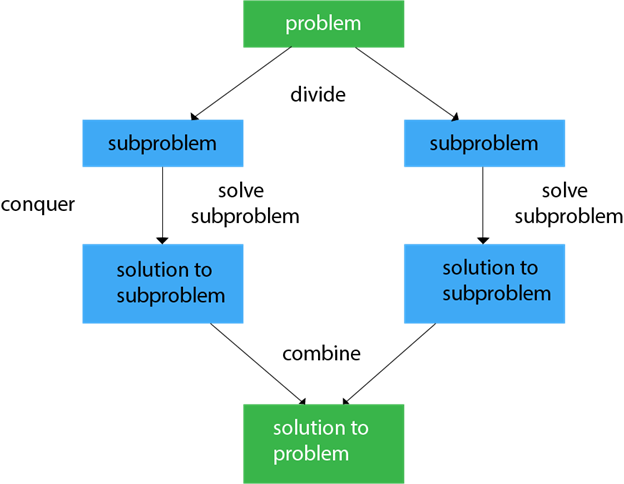
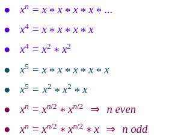
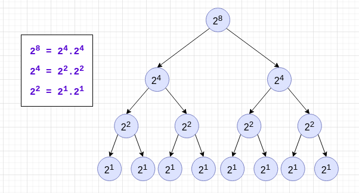
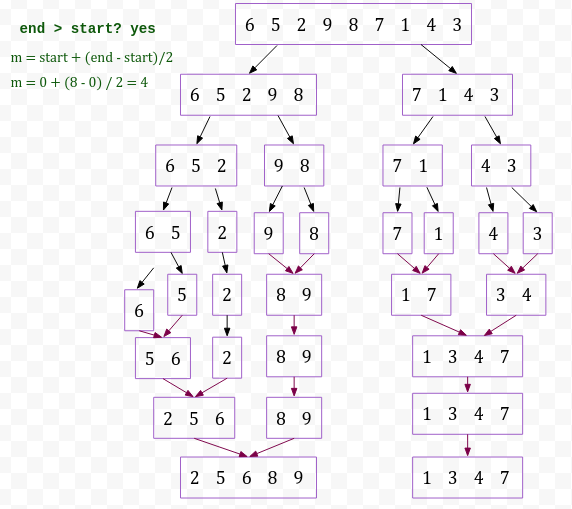
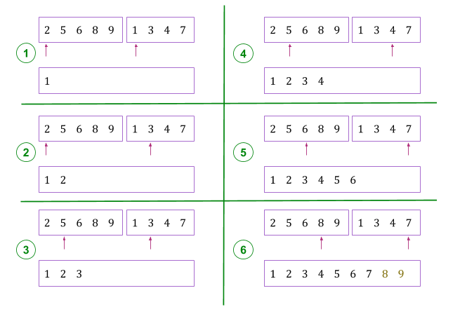
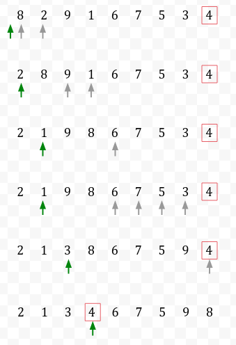

# Divide and Conquer

Divide and Conquer is an algorithmic paradigm. A typical Divide and Conquer algorithm solves a problem using following three steps.

1. **Divide** the original problem into a set of subproblems.
2. **Conquer:** Solve every subproblem individually, recursively.
3. **Combine:** Put together the solutions of the subproblems to get the solution to the whole problem.



##### Examples of Divide and Conquer

## 1. Calculate Power

If you want to compute  ( x raised to the power n), then the algorithm is simple:

```
pow(x,n)
   result = 1
   for i = 0 to n
      result *= x
   return result
```

```js
const pow = (x, n) => {
   let result = 1;
   for (let i = 0; i < n; i++) {
      result *= x;
   }
return result;
}
```

But the above function will take **O(n)** time because the result will happen ```n``` times. And it is computed as

```result = x * x * x * … … n-times```


### Divide & Conquer Approach:



```
pow(x,n)
   if n = 1
      return x
   if n is even
	return pow(x, n/2) * pow(x, n/2)
   if n is odd
	return pow(x, n/2) * pow(x, n/2) * x
```

T(n) = 2T(n / 2) + 1 = O(n)،

Improve the algorithm:

```
pow(x,n)
   if n = 1
      return x
   res = pow(x, n/2)
   if n is even
	return res * res
   if n is odd
	return res * res * x
```

T(n) = T(n / 2) + 1 = O(lg n)



## 2. Merge Sort

Merge Sort is a Divide and Conquer algorithm. It divides the input array into sublists of about half the size, sort each of the two sublists recursively until we have list sizes of length ```1```, in which case the list items are returned, then join the two sorted Sub lists back into one sorted list.





#### Algorithm Merge Sort:

```
mergeSort(arr, start, end)
   if (end > start)
      m = start + (end - start)/2    
      mergeSort(arr, start, med)   
      mergeSort(arr, med+1, end)    
      merge(arr, start, med, end)
```

#### Analysis:

Let **T(n)** be the total time taken in Merge Sort

1. Sorting two halves will be taken at the most ```2T(n/2)``` time.
2. When we merge the sorted lists, we have a total ```n``` comparison.

So, the relational formula becomes

**T(n) = 2T(n / 2) + O(n) = O(n log n)**

#### Properties:

- Time Complexity:  **O(n log n)**
- Space Complexity:  **O(n)**
- In-place
- Stable


## 3. Quick Sort

QuickSort is a Divide and Conquer algorithm. It picks an element as pivot and partitions the given array around the picked pivot,then put the picked pivot at its correct position in sorted array and put all smaller elements (smaller than the picked pivot) before it, and put all greater elements (greater than the picked pivot) after it.

- pick a number (pivot)
- put it in its right place
- sort left part
- sort right part

#### Pseudo code

```
quicksort(arr, start, end)
   if (end > start)
      pivot = partition(arr, start, end) 
      quicksort(arr, start, pivot-1)    
      quicksort(arr, pivot+1, end) 
```

#### Partition



### Partition - Pseudo code

```
partition(arr, start, end) 
   i = start-1          
   for j = start to end
      if arr[j] < arr[end]  
         i++                
         swap arr[i], arr[j]  
   i++          
   swap arr[i], arr[end]  
   return i   
```

### Analysis 

**Worst Case:** The worst case occurs when the partition process always picks greatest or smallest element as pivot. If we consider above partition strategy where last element is always picked as pivot, the worst case would occur when the array is already sorted in increasing or decreasing order. Following is recurrence for worst case. Following is recurrence for worst case.

``` T(n) = T(n-1) + n```. 

The solution of above recurrence is **O(n2)**.

**Best Case:** The best case occurs when the partition process always picks the middle element as pivot. Following is recurrence for best case.

 ```T(n) = T(n / 2) + O(n)```
The solution of above recurrence using Master Method is **O(n lg n)**. 

**Improvement:** pick random pivot.

#### Properties:

- Time Complexity:  **O(n log n)**
     - worst case  **O(n2)**
     - best case  **O(n lg n)**
     
- Space Complexity:  **O(1)**
- In-place
- Untable
