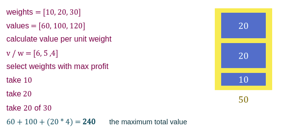

# Dynamic Programming

### Divide & conquer

- Divide the problem into small problems.
- Solve subproblems recursively.
- Combine solutions.

**But you may solve the same subproblem again**

###### For example:

#### [Fibonacci series](https://github.com/rehabas/Algorithms-Data-Structure/blob/main/Recursion.md#fibonacci-series)

In Fibonacci series, if we need to calculate ```fib(5)```, we need to calculate ```fib(4)``` and ```fib(3)```, and to calculate ```fib(4)```, we need to calculate ```fib(3)``` and ```fib(2)```, and so on.

```fib(n) = fib(n-1) + fib(n-2)```


Notice that, in the example above, we solve the the same subproblem ```fib(3)``` twice,  and we solve the the same subproblem ```fib(2)``` three times, and also  we solve the the same subproblem ```fib(1)``` twice,
we find that we solve the subproblems recursively. This is a disadvantage of Divide & Conquer algorithm.

### Greedy Algorithms

- Build solution step by step.
- In each step, select the best solution.

**But this may not get the best solution for the hole problem**

## Dynamic Programming

There are the two main properties of a problem that suggest that the given problem can be solved using Dynamic programming:

1. Overlapping Subproblems.
2. Optimal Substructure.

### 1. Overlapping Subproblems

- Divide the problem into small problems.
- Solve subproblems recursively.
- Store solutions to use it again instead of recalculate it.

Like Divide and Conquer, Dynamic Programming combines solutions to sub-problems. Dynamic Programming is mainly used when solutions of same subproblems are needed again and again. In dynamic programming, computed solutions to subproblems are stored in a table so that these don’t have to be recomputed. So Dynamic Programming is not useful when there are no common (overlapping) subproblems because there is no point storing the solutions if they are not needed again. For example, Binary Search doesn’t have common subproblems. If we take an example of following recursive program for **Fibonacci Numbers**, there are many subproblems which are solved again and again.

```js
const fib = n => {
   if (n <= 1) return n;
   return fib(n-1) + fib(n-2);
}
```

Recursion tree for execution of ```fib(5)```


We can see that the function ```fib(3)``` is being called ```2``` times. If we would have stored the value of ```fib(3)```, then instead of computing it again, we could have reused the old stored value. There are following two different ways to store the values so that these values can be reused:

1. Memoization (Top Down)
2. Tabulation (Bottom Up)

#### 1. Memoization (Top Down)

The memoized program for a problem is similar to the recursive version with a small modification that it looks into a lookup table before computing solutions. We initialize a lookup array with all initial values as ```NULL```. Whenever we need the solution to a subproblem, we first look into the lookup table. If the precomputed value is there then we return that value, otherwise, we calculate the value and put the result in the lookup table so that it can be reused later.


**Algorithm:**

```
lookup[max]  // max: The maximum size we can reach, i.e fib(5) , max = 6
   fib(n)
      if n <=1 return n
      if lookup[n] is null
         lookup[n] = fib(n-1) + fib(n-2)
      return lookup[n]
```

#### 2. Tabulation (Bottom Up)

The tabulated program for a given problem builds a table in bottom up fashion and returns the last entry from table. For example, for the same Fibonacci number, we first calculate ```fib(0)``` then ```fib(1)``` then ```fib(2)``` then ```fib(3)``` and so on. So literally, we are building the solutions of subproblems bottom-up.

Following is the tabulated version for n<sup>th</sup> Fibonacci Number.

```
lookup[max]
fib(n)
   lookup[0] = 0
   lookup[1] = 1
   for i = 2 to n
	     lookup[i] = arr[i-1] + arr[i-2]
   return lookup[n]
```

### 2. Optimal Substructure

#### Fractional Knapsack Problem

you can take a part of item



#### 0/1 Knapsack Problem

you can’t take a part of item, you should take the item as a whole or should leave it. That's why it is called 0/1 knapsack Problem.

- We have to either take an item completely or leave it completely.
- Cannot take a fractional amount of an item taken or take an item more than once.
- It cannot be solved by the Greedy Approach because it is enable to fill the knapsack to capacity.
- Greedy Approach doesn't ensure an Optimal Solution.
- It is solved using dynamic programming approach.

###### Example

The maximum weight the knapsack can hold is ```5```. There are three items to choose from. Their weights and values are presented as:


Is this the biggest profit w can get? No, because if we took ```20``` and ```30```, the profit would be ```100 + 120 = 220```, meaning this solution did not give us the maximum value, which is the optimum solution (the best solution for us).

###### solution

**Given**

- Knapsack capacity ```(w) = 5 kg```
- Number of items ```(n) = 3```

**Step 1:**
 
- Draw a table say ```T``` with ```(n+1) = 4 + 1 = 5``` number of rows and ```(w+1) = 5 + 1 = 6``` number of columns.
- Fill all the boxes of 0<sup>th</sup> row and 0<sup>th</sup> column with ```0```.


**Step 2:**
 
Start filling the table row wise top to bottom from left to right using the formula:

```T[i, j] = max{T[i-1][j], value(i) + T[i-1][j - weight(i)]}```

for example,  The value of ```T[2, 3]``` was computed as follows:

```
T[2, 3] = max{T[2-1][3], value(2) + T[2-1][3 - weight(2)]}
        = max{T[1][3], 100 + T[1][3-2]}
	= max{60, 100 + 60}
	= max{60, 160}
	= 60
```

After all the entries are computed and filled in the table, we get the following table:


- The last entry represents the maximum possible value that can be put into the knapsack.
- So, maximum possible value that can be put into the knapsack = ```220```.

**Identifying Items To Be Put Into Knapsack:**
 
Items that must be put into the knapsack to obtain the maximum value ```220``` are:

 ```Item-2``` and ```Item-3```, And their values, respectively, are ```100, 120```.
 
**Time Complexity:**
 
- Each entry of the table requires constant time **O(1)** for its computation.
- It takes **O(nw)** time to fill ```(n+1)(w+1)``` table entries.
- It takes **O(n)** time for tracing the solution since tracing process traces the ```n``` rows.
- Thus, overall **O(nw)** time is taken to solve 0/1 knapsack problem using dynamic programming.
