# Graph

## what is a graph ?

A Graph is a non-linear data structure consists of a finite set of vertices(or nodes) and set of Edges which connect a pair of nodes.


In the above Graph, the set of vertices ```V = {0,1,2,3,4}``` and the set of edges ```E = {01, 12, 23, 34, 04, 14, 13}```.

### Graph Applications

Graphs are used to represent **networks and relations**.

- Friendships.

- Roads between cities.

- Network points.

### Undirected Graph

Edges are not associated with the directions with them.

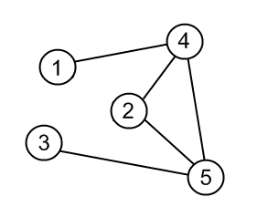

An undirected graph is shown in the above figure since its edges are not attached with any of the directions. If an edge exists between vertex ```1``` and ```4``` then the vertices can be traversed from ```4``` to ```1``` as well as ```1``` to ```4```.

### Directed Graph

In a directed graph, edges form an ordered pair.

A directed graph is shown in the following figure.

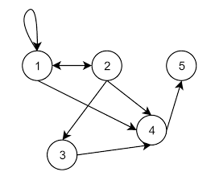

Edges represent a specific path from some vertex ```1``` to another vertex ```4```. Node ```1``` is called initial node while node ```4``` is called terminal node.

### Weighted Graph

In a weighted graph, each edge is assigned with some data such as length or weight. The weight of an edge e can be given as ```w(e)``` which must be a positive ```(+)``` value indicating the cost of traversing the edge.

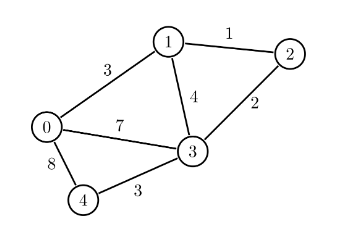

### Unweighted Graph

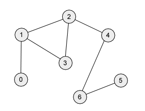

### Graph Terminology

#### Path

A path can be defined as the sequence of nodes that are followed in order to reach some terminal node ```V``` from the initial node ```U```.

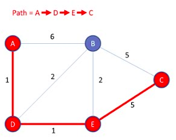

#### Closed Path

A path will be called as closed path if the initial node is same as terminal node. A path will be closed path if **V<sub>0</sub> = V<sub>N</sub>**.

#### Simple Path

A graph with no repeated vertices.

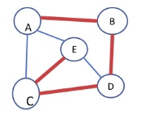

The path from ```A``` to ```B``` is a simple path.

#### Cycle

Simple path, except that the last vertex is the same as the first vertex. Its also known as a circuit or circular path.

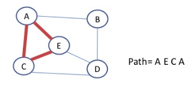

#### connected graph

Any two vertices are connected by some path.

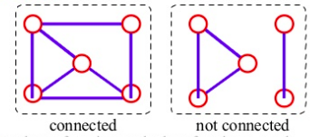

#### Complete Graph

A complete graph is the one in which every node is connected with all other nodes. A complete graph contain ```n(n-1)/2``` edges where ```n``` is the number of nodes in the graph.

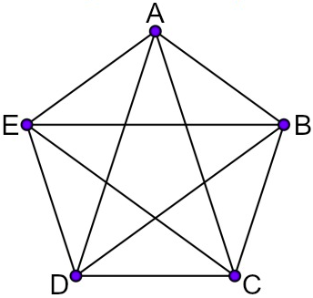

#### Adjacent Nodes

Two nodes are adjacent if they are connected by an edge.


```4``` is adjacent to ```5```

#### Degree of the Node

A degree of a node is the number of edges that are connected with that node. A node with degree ```0``` is called as isolated node.


    the degree of 
       Node Number 0 is 3(3, 7, 8)
       Node Number 1 is 3(1, 3, 4) 
       Node Number 2 is 2(1, 2) 
       Node Number 3 is 4(2, 3, 4, 7) 
       Node Number 4 is 2(3, 8) 

## Graph Representation

### 1. Adjacency List

- An array of lists is used. The size of the array is equal to the number of vertices. Let the array be an ```array[]```. An entry ```array[i]``` represents the list of vertices adjacent to the **i<sup>th</sup>** vertex.

- An adjacency list is maintained for each node present in the graph which stores the node value and a pointer to the next adjacent node to the respective node.

- If all the adjacent nodes are traversed then store the ```NULL``` in the pointer field of last node of the list. 

- The sum of the lengths of adjacency lists is equal to the twice of the number of edges present in an undirected graph.

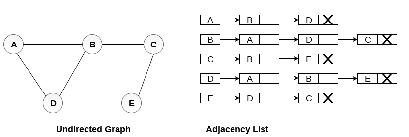

- In a **directed graph**, the sum of lengths of all the adjacency lists is equal to the number of edges present in the graph.

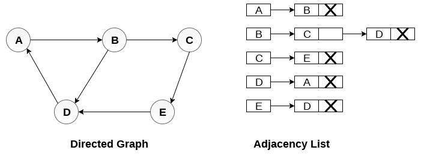

- In the case of weighted directed graph, each node contains an extra field that is called the weight of the node.

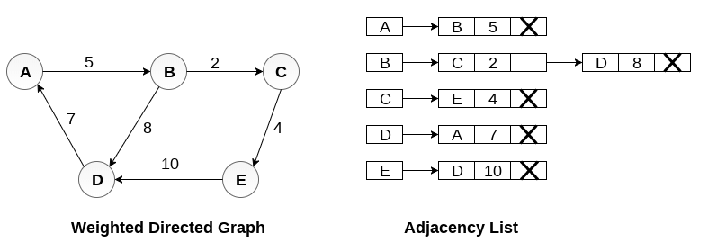

### 2. Adjacency Matrix

- In adjacency matrix, the rows and columns are represented by the graph vertices. A graph having ```n``` vertices, will have a dimension ```n * n```.

- An entry **M<sub>ij</sub>** in the adjacency matrix representation of an undirected graph ```G``` will be ```1``` if there exists an edge between **V<sub>i</sub>** and **V<sub>j</sub>**.

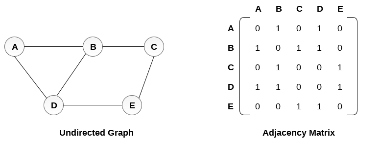

- In directed graph, an entry **A<sub>ij</sub>** will be ```1``` only when there is an edge directed from **V<sub>i</sub>** to **V<sub>j</sub>**.

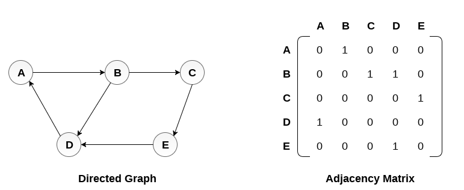

- Representation of **weighted directed graph** is different. Instead of filling the entry by ```1```, the Non- zero entries of the adjacency matrix are represented by the **weight** of respective edges.

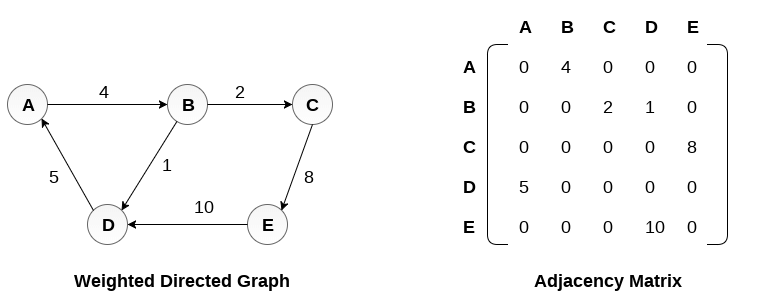

## Minimum Spanning Tree

- **Spanning tree** is a non-cyclic sub-graph of a connected and undirected graph ```G``` that connects all the vertices together. 

- A graph ```G``` can have multiple spanning trees.

- There can be weights assigned to every edge in a weighted graph. 

- **Minimum spanning tree** is the one which contains the least weight among all other spanning tree of some particular graph.

###### Algorithm 

1. Create a set ```mstSet``` that keeps track of vertices already included in **MST**. 

2. Assign a key value to all vertices in the input graph. Initialize all key values as ```INFINITE```. Assign key value as ```0``` for the first vertex so that it is picked first. 

3. While ```mstSet``` doesn’t include all vertices 

   a.  Pick a vertex ```u``` which is not there in ```mstSet``` and has minimum key value. 
   
   b.  Include ```u``` to ```mstSet```. 
   
   c. Update key value of all adjacent vertices of ```u```. To update the key values, iterate through all adjacent vertices. For every adjacent vertex ```v```, if weight of edge ```u-v``` is less than the previous key value of ```v```, update the key value as weight of ```u-v```.

###### Example

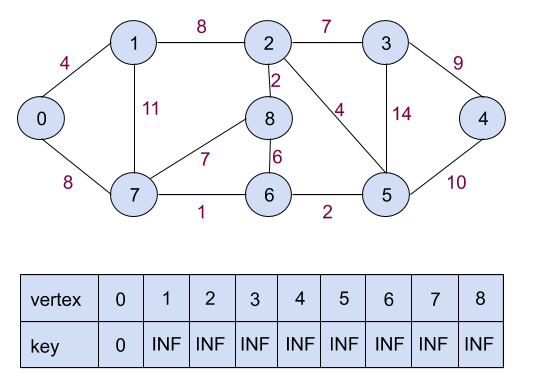

The set ```mstSet``` is initially empty and keys assigned to vertices are ```{0, INF, INF, INF, INF, INF, INF, INF, INF}``` where ```INF``` indicates ```infinite```. Now pick the vertex with the minimum key value. The vertex ```0``` is picked, include it in ```mstSet```. So ```mstSet``` becomes ```{0}```. After including to ```mstSet```, update key values of adjacent vertices. Adjacent vertices of ```0``` are ```1``` and ```7```. The key values of ```1``` and ```7``` are updated as ```4``` and ```8```. Following subgraph shows vertices and their key values, only the vertices with finite key values are shown. The vertices included in **MST** are shown in green color.

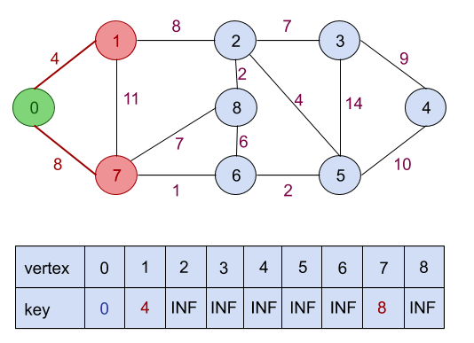

Pick the vertex with minimum key value and not already included in ```MST``` (not in ```mstSET```). The vertex ```1``` is picked and added to ```mstSet```. So ```mstSet``` now becomes ```{0, 1}```. Update the key values of adjacent vertices of ```1```. The key value of vertex ```2``` becomes ```8```. On the other hand, weight og edge ```1,7``` is ```11``` whereas the key of vertex ```7``` is already ```8``` and ```8 < 11```. So key of vertix ```7``` won't be updated.

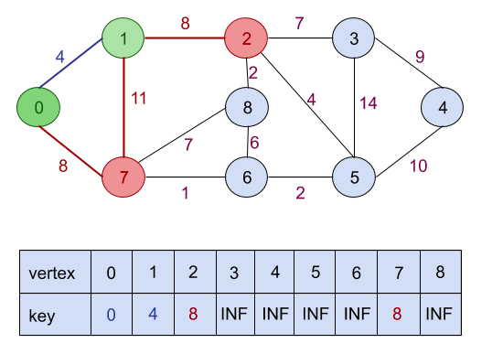

Pick the vertex with minimum key value and not already included in ```MST``` (not in ```mstSET```). We can either pick vertex ```7``` or vertex ```2```, let vertex ```7``` is picked. So ```mstSet``` now becomes ```{0, 1, 7}```. Update the key values of adjacent vertices of ```7```. The key value of vertex ```6``` and ```8``` becomes ```1``` and ```7``` respectively. 

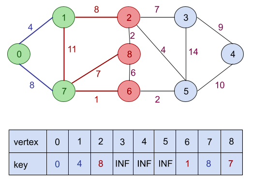

Pick the vertex with minimum key value and not already included in ```MST``` (not in ```mstSET```). Vertex ```6``` is picked. So ```mstSet``` now becomes ```{0, 1, 7, 6}```. Update the key values of adjacent vertices of ```6```. The key value of vertex ```5``` and ```8``` are updated.

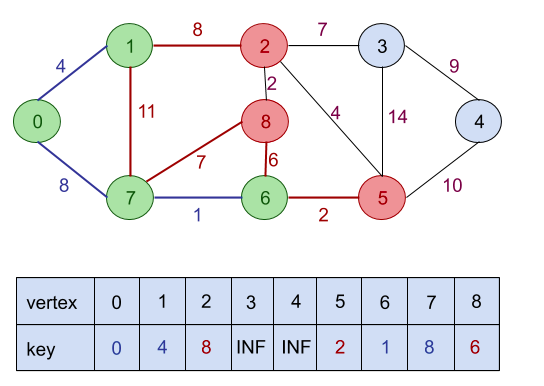

Pick the vertex with minimum key value and not already included in ```MST``` (not in ```mstSET```). Vertex ```5``` is picked. So ```mstSet``` now becomes ```{0, 1, 7, 6, 5}```. Update the key values of adjacent vertices of ```5```. The key value of vertex ```2```, ```3``` and ```4``` are updated.

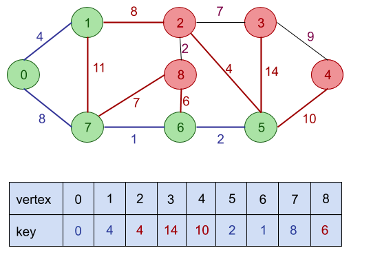

Pick the vertex with minimum key value and not already included in ```MST``` (not in ```mstSET```). Vertex ```2``` is picked. So ```mstSet``` now becomes ```{0, 1, 7, 6, 5, 2}```. Update the key values of adjacent vertices of ```2```. The key value of vertex ```3``` and ```8``` are updated.

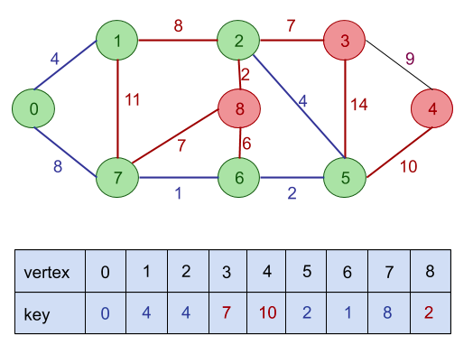

Pick the vertex with minimum key value and not already included in ```MST``` (not in ```mstSET```). Vertex ```8``` is picked. So ```mstSet``` now becomes ```{0, 1, 7, 6, 5, 2, 8}```. We see that vertex ```8``` hass no vertex adjacent to it; not already included in ```MST``` (not in ```mstSET```), thus no keys will be updated in this case.

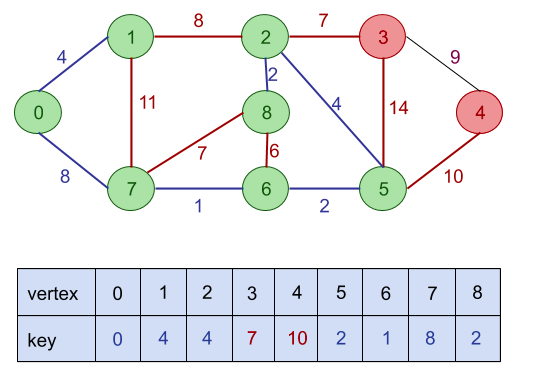

vertex ```3``` wil be picked now because its key is less than that of vertex ```4```, which is the only other vertex left not in ```mstSet``` and not already included in ```MST```. So ```mstSet``` now becomes ```{0, 1, 7, 6, 5, 2, 8, 3}```. Update the key values of adjacent vertices of ```3```. The key value of vertex ```4``` is updated.

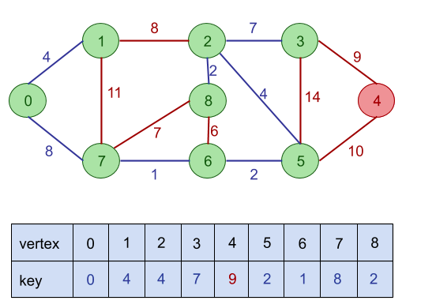

Pick the last remaining vertex ```4``` and add it to ```mstSet```. So ```mstSet``` now becomes ```{0, 1, 7, 6, 5, 2, 8, 3, 4}```.

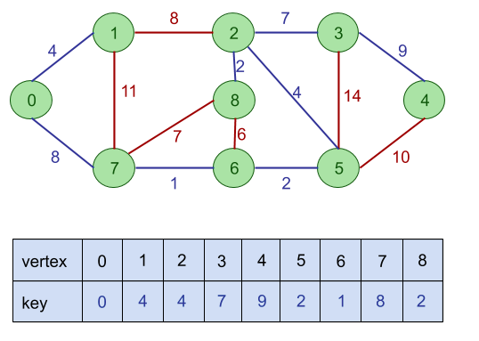

Finally, we get the following graph.

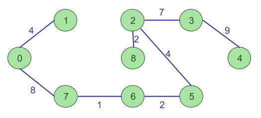

The graph produces above is the minimum spanning tree of the graph shown in our example.

The cost of **MST** will be calculated as;

```cost(MST) = 4 + 8 + 1 + 2 + 4 + 2 + 7 + 9 = 37 units```.
