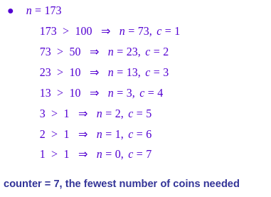
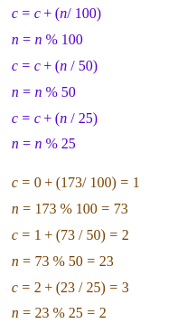
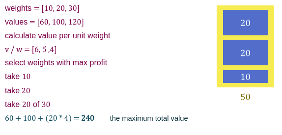

# Greedy Algorithms

## What is “Greedy Algorithms”?

- Algorithms Paradigm that builds up a solution piece by piece
- always choosing the next piece that offers the most obvious and immediate benefit
- Greedy algorithms are used for optimization problems
- At every step, we can make a choice that looks best at the moment, and we get the optimal solution of the complete problem

##### Examples of Greedy Algorithms

## 1. Minimum number of coins

- Given a value of ```n```
- We have coins of ```(1,5,10,25,50,100)```
- What is minimum number of coins needs to get ```n```

**Solution:** Greedy Approach.

**Approach:** A common intuition would be to take coins with greater value first. This can reduce the total number of coins needed. Start from the largest possible denomination and keep adding denominations while the remaining value is greater than 0.

1. Sort the array of coins in decreasing order.
2. Initialize result as empty.
3. Find the largest denomination that is smaller than current amount.
4. Add found denomination to result. Subtract value of found denomination from amount.
5. If amount becomes ```0```, then print result.
6. Else repeat steps 3 and 4 for new value of ```n```.



```
if n >= 100
   subtract 100
if n >= 50
   subtract 50
if n >= 25
	  subtract 25
……..
repeat until n = 0
```

###### improvement:



## 2. Fractional Knapsack Problem

- given ```n``` items have weights and values.
- you want to fill a bag of capacity ```c``` with items to get maximum value.



### Knapsack Problem

**Fractional Knapsack Problem:** you can take a part of item.

**0/1 Knapsack Problem:** you can’t take a part of item.


