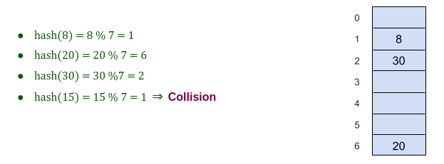
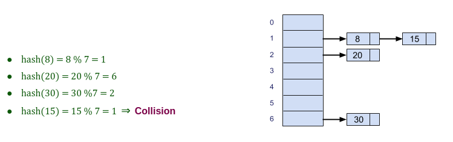
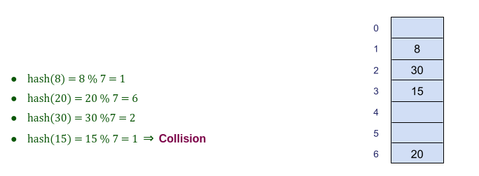
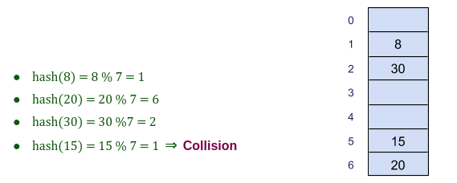

# Hashing

- Hashing is an important Data Structure which is designed to use a special function called the **Hash function** which is used to map a given value with a particular key for faster access of elements.
- Used to optimize search.
- Each value goes to a specific place.

**Some examples of how hashing is used in our lives include:**

- In universities, each student is assigned a unique roll number that can be used to retrieve information about them.
- In libraries, each book is assigned a unique number that can be used to determine information about the book, such as its exact position in the library or the users it has been issued to etc.

In both these examples the students and books were hashed to a unique number.

- ```hash()``` take the value and return the place it should goes to.
- ```hash(v) = v % array_size```.

For example if the list of values is ```[8, 20, 30]``` it will be stored at positions {1, 6, 2} in the array or Hash table respectively.



## Collision

When two values is mapping to the same hash.

**Ways to handle collision:**

1. Separate Chaining
2. Open Addressing

### 1. Separate Chaining

Separate chaining is one of the most commonly used collision resolution techniques. It is usually implemented using linked lists. In separate chaining, **each element of the hash table is a linked list**. To store an element in the hash table you must insert it into a specific linked list. If there is any collision (i.e. two different elements have same hash value) then store both the elements in the same linked list.



#### Advantages:

1. Simple to implement.
2. Hash table never fills up, we can always add more elements to the chain.

#### Disadvantages:

1. Wastage of Space (Some Parts of hash table are never used)
2. If the chain becomes long, then search time can become **O(n)** in the worst case (when all the entries are inserted into the same linked list).
3. Uses extra space for links.

### 2. Open Addressing

- When collision occurs, find another place in the hash table.

- In open addressing, instead of in linked lists, all entry records are stored in the array itself. When a new entry has to be inserted, the hash index of the hashed value is computed and then the array is examined (starting with the hashed index). If the slot at the hashed index is unoccupied, then the entry record is inserted in slot at the hashed index else it proceeds in some probe sequence until it finds an unoccupied slot.

Open Addressing is done in the following ways: 

- Linear Probing
- Quadratic Probing
- Double Hashing

#### Linear probing

- Linear probing is when the interval between successive probes is fixed (usually to 1). 

- If the place is not empty, go to the next place.

      hash(v)
        
      hash(v) + 1

      hash(v) + 2

      hash(v) + i



#### Quadratic Probing

- If the place is not empty, go to i<sup>2</sup>

     hash(v)
      
     hash(v) + 1<sup>2</sup>
      
     hash(v) + 2<sup>2</sup>
      
     hash(v) +i<sup>2</sup>



#### Double Hashing

- Use another hash function ```hash2(v)``` and look for ```i * hash2(v)``` slot in i<sup>th</sup> rotation. 

     hash(v)
     
     hash(v) + hash2(v)
     
     hash(v) + 2 * hash2(v)
     
     hash(v) + i * hash2(v)

     hash2(v) = PRIME – (v % PRIME), where PRIME is a prime number less than the size of array or hash table.

#### Advantages:

1. Open addressing provides better cache performance as everything is stored in the same table.

2. No links in Open addressing

#### Disadvantages:

1. In open addressing, table may become full.
