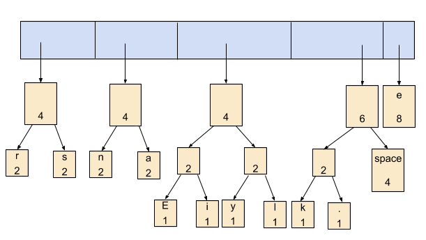

# Huffman Coding

## Huffman Coding: An Application of Binary Trees and Priority Queues

- Huffman coding is a technique used to encode and compress data for transmission.
- More frequently used symbols have shorter code.
- Min number of bits needed.
- Works well for text and fax transmissions.
- Code word lengths are no longer fixed like ASCII.
- Code word lengths vary and will be shorter for the more frequently used characters.

### 1. Count characters

- Consider the following short text:

   ```Eerie eyes seen near lake.```
   
- Count up the occurrences of all characters in the text

   ```Eerie eyes seen near lake.```
   
   - What characters are present?
   
      ```E  e  r  i space y s n a r l k .```
      
   - What is the frequency of each character in the text? (Count the occurrences of each character in the text)
   
   
   
### 2.Create priority queue
   
- Place characters and counts into priority queue (the priority queue will organize them into ascending order)


### 3. Build Huffman tree

- Use priority queue to create Huffman tree.

      While priority queue contains two or more nodes
        - Create new node
        - Dequeue node and make it left subtree
        - Dequeue next node and make it right subtree
        - Frequency of new node equals sum of frequency of left and right children 
        - Enqueue new node back into queue





- This tree contains the new code words for each character.
- Frequency of root node should equal the number of characters in text.
 
       Eerie eyes seen near the lake.      (26 characters)

### 4. Tree to binary encodings

- The Huffman tree tells you the binary encodings to use.
- **left** means ```0```, **right** means ```1```
- Example:

      'y':  left, left, right, left
      the binary encodings of 'y' is 0010
      


### 5. compress the actual file

- Rescan text and encode file using new code words

      Eerie eyes seen near lake.
      


### Results

- Have we made things any better?

      73 bits to encode the text
      ASCII would take :
	         8 * 26 = 208 bits
      compression ratio = 73 / 208 = 35%

## Decoding the File

### The algorithm:

- Read each bit one at a time from the input.
- If the bit is ```0```, go **left** in the tree; if it is ```1```, go **right**.
- If you reach a leaf node, output the character at that leaf and go back to the tree root.

###### Example:

Use the tree to decompress a compressed file with these bits:

     00000111001111000110001011100111001100100111001111010111101011100111001111110011100111111011110001100110111111011010001
     1100101


###### Output

       Eerie eyes seen near lake.
     


