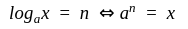
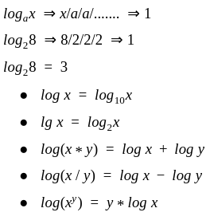
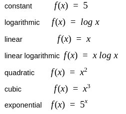
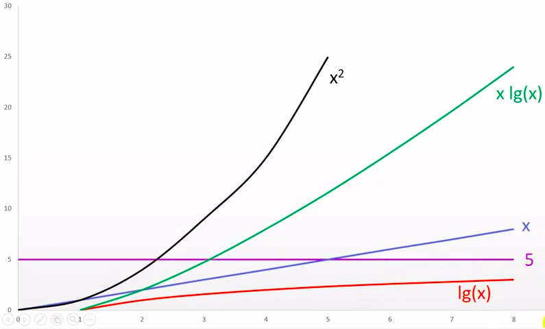
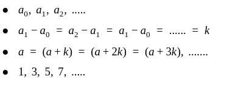
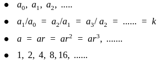

# Intro to Algorithm Analysis

## Analysis of Algorithms

We can have three cases to analyze an algorithm: 

#### 1) Worst Case 

#### 2) Average Case 

#### 3) Best Case

## How to represent the Quality?

How much does the code take on my computer ?! we want a more general way, Hence the role of:

#### Mathematical Equations 

A relation between input size and time

We will express algorithm by a Mathematical Equations

### Mathematical Requirements: 

#### Exponentials:

##### Power

Repeated Multiplication 


###### Power Properties


##### Logarithms

Inverse of power



Repeated Division



#### Functions:

relation between input and output

##### Popular Functions



#### Graphs:

visual way to represent a function

**2D Graph**

```x-axis``` (horizontal):  independent variable ```x```

```y-axis``` (vertical):  dependent variable ```f(x)```



#### Series:

Collection of terms  

a<sub>0</sub>, a<sub>1</sub>, a<sub>2<sub/>, .....

##### 1. Arithmetic Series



##### 2. Geometric Series



##### Sum of Terms


