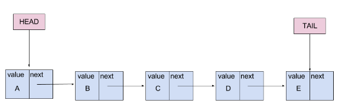
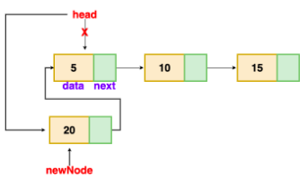
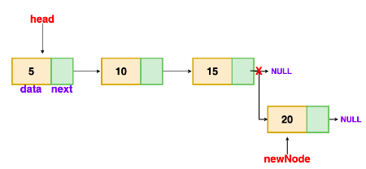
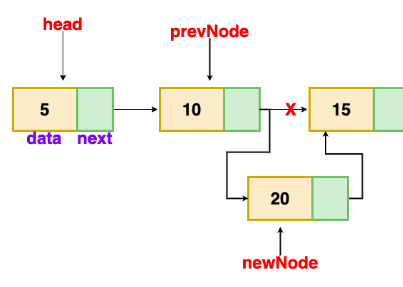

# Linked Lists

why there is a need for a linked list?

If we want to store the value in a memory, we need a memory manager that manages the memory for every variable. For example, if we want to create a variable of integer type like:

```int x;```

In the above example, we have created a variable ```x``` of type integer. As we know that integer variable occupies ```4``` bytes, so ```x``` variable will occupy ```4``` bytes to store the value.

Suppose we want to create an array of integer type like:

```int x[3];```

In the above example, we have declared an array of size ```3```. As we know, that all the values of an array are stored in a continuous manner, so all the three values of an array are stored in a sequential fashion. The total memory space occupied by the array would be ```3*4 = 12 bytes```.

**There are two major drawbacks of using array:**

- We cannot insert more than ```3``` elements in the above example because only ```3``` spaces are allocated for ```3``` elements.
- In the case of an array, lots of wastage of memory can occur. For example, if we declare an array of ```50``` size but we insert only ```10``` elements in an array. So, in this case, the memory space for other 40 elements will get wasted and cannot be used by another variable as this whole space is occupied by an array.
In array, we are providing the fixed-size at the compile-time, due to which wastage of memory occurs. The solution to this problem is to use the linked list.


## What is Linked List?

A linked list is a linear data structure, in which the elements are not stored at contiguous memory locations. The elements in a linked list are linked using **pointers**.

- Put elements in **non-relative** places.
- Use **pointers** to chain elements together.

## Types of Linked List

### 1. Singly Linked List

The singly linked list is a data structure that contains two parts, i.e., one is the **data part**, and the other one is the **address part**, which contains the address of the next or the successor node. The address part in a node is also known as a **pointer**.

- Consists of collection of **nodes**.
- First node is called **head**.
- Last node is called **tail**.
- Each node has a **value** and a **pointer** to next node.
- Last node points to **null**.


### Operations on Linked List

#### Get Element



```
get(i)
	current = head
	for i = 0 to i
		current = current.next
	return current.value
```

- ```i```: The index for the element I want.
- ```current```: A pointer that points to the element I'm currently standing on. Starting from the head, because it is the only place who I know where it is.

#### Set Element

```
set(i, v)
	current = head
	for i = 0 to i
		current = current.next
	current.value = v
```

#### Add Element 

A node can be added in three ways:

##### 1. At the front of the linked list 

The new node is always added before the head of the given Linked List. And newly added node becomes the new head of the Linked List.



```
addFirst(v)
	newNode = new Node(v)
	if list is empty
		head = tail = newNode
	else
		newNode.next = head
		head = newNode
	n++
```

##### 2. At the end of the linked list

The new node is always added after the last node of the given Linked List. 



```
addLast(v)
	newNode = new Node(v)
	if list is empty
		head = tail = newNode
	else
		tail.next = newNode
		tail = newNode
	n++
```

##### 3. After a given node

We are given pointer to a node, and the new node is inserted after the given node.



