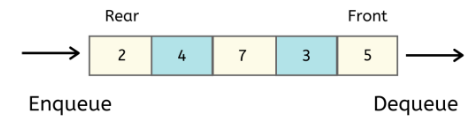

# Queue

## What is the Queue?

- A Queue is a linear structure which follows a particular order in which the operations are performed. The order is **First In First Out (FIFO)**.
- Added element goes to back **(rear)**.
- Take the first element **(front)**.
- A good example of a queue is any queue of consumers for a resource where the consumer that came first is served first.
- The difference between stacks and queues is in removing. In a stack we remove the item the most recently added; in a queue, we remove the item the least recently added.



## Queue Implementation

- Using Array
- Using Linked List
- Using Stack

## Queue Properties and Methods

- ```front```: the first element in the queue.
- ```rear```: the last element in the queue.
- ```enqueue(e)```: add element to the queue.
- ```dequeue()```: remove element from the queue.

## Types of Queue

### 1. Circular Queue

A circular queue is similar to a linear queue as it is also based on the **FIFO (First In First Out)** principle except that the last position is connected to the first position in a circular queue that forms a circle. It is also known as a **Ring Buffer**.


There was one limitation in the array implementation of Queue. If the rear reaches to the end position of the Queue then there might be possibility that some vacant spaces are left in the beginning which cannot be utilized. So, to overcome such limitations, the concept of the circular queue was introduced.


As we can see in the above image, the rear is at the last position of the Queue and front is pointing somewhere rather than the 0<sup>th</sup> position. In the above array, there are only two elements and other three positions are empty. The rear is at the last position of the Queue, if we try to insert the element then it will show that there are no empty spaces in the Queue. There is one solution to avoid such wastage of memory space by shifting both the elements at the left and adjust the front and rear end accordingly. It is not a practically good approach because shifting all the elements will consume lots of time. The efficient approach to avoid the wastage of the memory is to use the circular queue data structure.


#### Applications of Circular Queue

**Memory management:** As we have already seen that in linear queue, the memory is not managed very efficiently. But in case of a circular queue, the memory is managed efficiently by placing the elements in a location which is unused.

**CPU Scheduling:** The operating system also uses the circular queue to insert the processes and then execute them.

**Traffic system:** Each light of traffic light gets ```ON``` one by one after every interval of time. Like ```red``` light gets ```ON``` for one minute then ```yellow``` light for one minute and then ```green``` light. After ```green``` light, the ```red``` light gets ```ON```.

### 2. Priority Queue

- Every item has a priority associated with it.
- An element with high priority is dequeued before an element with low priority.
- If two elements have the same priority, they are served according to their order in the queue.

## Queue Applications

- Implement many algorithms and data structures.
- Operating Systems.

