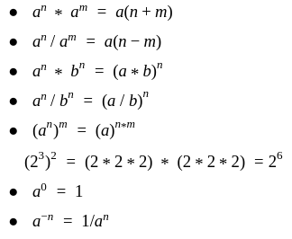
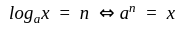
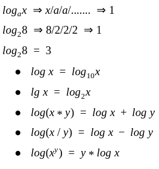
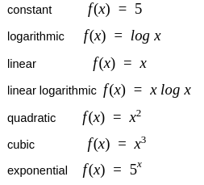
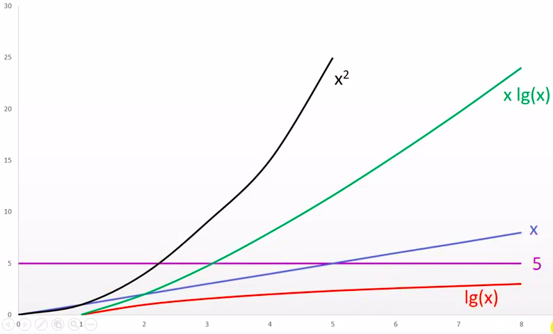
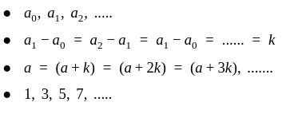
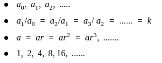
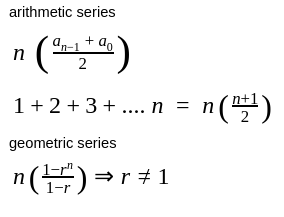
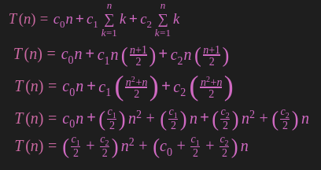
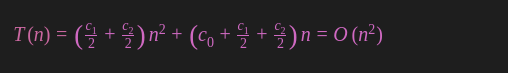

# Algorithms & Data Structure

## What is "Data-Structure"?

A way to store and organize data in memory in a specific structure so that it can be used efficiently.

## Need of Data Structures
As applications are getting complexed and amount of data is increasing day by day, there may arrise the following problems:

**Processor speed:** To handle very large amout of data, high speed processing is required, but as the data is growing day by day to the billions of files per entity, processor may fail to deal with that much amount of data.

**Data Search:** Consider an inventory size of 106 items in a store, If our application needs to search for a particular item, it needs to traverse 106 items every time, results in slowing down the search process.

**Multiple requests:** If thousands of users are searching the data simultaneously on a web server, then there are the chances that a very large server can be failed during that process

in order to solve the above problems, data structures are used. Data is organized to form a data structure in such a way that all items are not required to be searched and required data can be searched instantly.

## Data Structure Classification


There are two types of data structures:

### 1- Primitive Data structure

The primitive data structures are primitive data types. The ```int```, ```char```, ```float```, ```double```, and ```pointer``` are the primitive data structures that can hold a single value.

### 2- Non-Primitive Data structure

The non-primitive data structure is divided into two types:

**Linear Data Structures:** A data structure is called linear if all of its elements are arranged in the linear order. In linear data structures, the elements are stored in non-hierarchical way where each element has the successors and predecessors except the first and last element.

**Non Linear Data Structures:** This data structure does not form a sequence i.e. each item or element is connected with two or more other items in a non-linear arrangement. The data elements are not arranged in sequential structure.

## What is "Algorithms"?
 
- Steps to solve the problem.

- A finite set of instructions which are being carried in a specific order to perform the specific task. It is not the complete program or code; it is just a solution (logic) of a problem, which can be represented either as an informal description using a Flowchart or Pseudocode.

## Need of Algorithm

1. To understand the basic idea of the problem.

2. To find an approach to solve the problem.

3. To improve the efficiency of existing techniques.
 
 Let's understand the algorithm through a real-world example. Suppose we want to make a lemon juice, so following are the steps required to make a lemon juice:

**Step 1:** First, we will cut the lemon into half.

**Step 2:** Squeeze the lemon as much you can and take out its juice in a container.

**Step 3:** Add two tablespoon sugar in it.

**Step 4:** Stir the container until the sugar gets dissolved.

**Step 5:** When sugar gets dissolved, add some water and ice in it.

**Step 6:** Store the juice in a fridge for 5 to 10 minutes.

**Step 7:** Now, it's ready to drink.

The above real-world can be directly compared to the definition of the algorithm. We cannot perform the step 3 before the step 2, we need to follow the specific order to make lemon juice. An algorithm also says that each and every instruction should be followed in a specific order to perform a specific task.

Now we will look an example of an algorithm in programming.

We will write an algorithm to **add two numbers entered by the user**.

The following are the steps required to add two numbers entered by the user:

**Step 1:** Start

**Step 2:** Declare three variables ```a```, ```b```, and ```sum```.

**Step 3:** Enter the values of ```a``` and ```b```.

**Step 4:** Add the values of ```a``` and ```b``` and store the result in the ```sum``` variable, i.e., ```sum = a + b```.

**Step 5:** Print ```sum```

**Step 6:** Stop

--------------------------

## Mathematical Equations 

A relation between input size and time

We will express algorithm by a Mathematical Equations

## Mathematical Requirements: 

### Exponentials:

#### Power

Repeated Multiplication 


##### Power Properties



#### Logarithms

Inverse of power



Repeated Division



### Functions:

relation between input and output

#### Popular Functions



### Graphs:

visual way to represent a function

**2D Graph**

```x-axis``` (horizontal):  independent variable ```x```

```y-axis``` (vertical):  dependent variable ```f(x)```



### Series:

Collection of terms  

a<sub>0</sub>, a<sub>1</sub>, a<sub>2<sub/>, .....

#### 1. Arithmetic Series



#### 2. Geometric Series



#### Sum of Terms



------------------------------

## Algorithm Complexity

The performance of the algorithm can be measured in two factors:

**Time complexity:** The amount of time required to complete the execution.

The time complexity of an algorithm is denoted by the ```big O notation```. Here, ```big O notation``` is the asymptotic notation to represent the time complexity.

The time complexity is mainly calculated by counting the number of steps to finish the execution. 

**Space complexity:** The amount of space required to solve a problem and produce an output.

Similar to the time complexity, space complexity is also expressed in ```big O notation```.

### How to analysis

- count time for each line

- sum all times

Assume the time is ```c```




We want to simplify it more.

### Reduction Rules

1. ignore constants

2. ignore lower bounds



-------------------

## What we will learn

