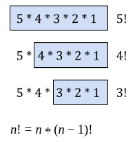
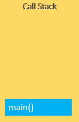
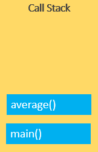
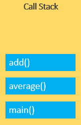
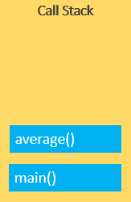
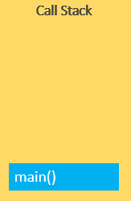
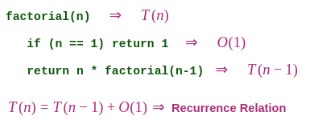
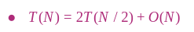
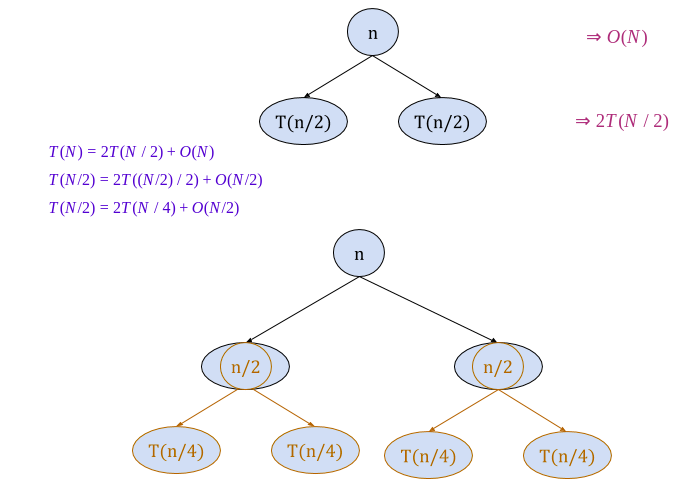

# Recursion

## What is Recursion?

when function calls itself.

- The process in which a function calls itself directly or indirectly is called **recursion** and the corresponding function is called as **recursive function**. 

```js
var myFunc = function() {
   myFunc();
}
```

## Base case

condition stop recursion.

```js
var myFunc = function(n) {
   if (n <= 1) // base case
      return 1;
   else 
      return myFunc(n-1);
}
```

In the above example, base case for n <= 1 is defined and larger value of number can be solved by converting to smaller one till base case is reached.

## Recursion thinking

### How to think in Recursion?

- Recursion is when function calls itself.
- The function used itself to solve the problem **but on smaller input**.

### Factorial


#### Factorial - FOR loop

``` js
const factorialize = (n) => {
   if (n === 0) return 1
   for (let i = n - 1; i >= 1; i--) {
       n *= i;
   }
   return n; 
}
```

#### Factorial - Recursive solution



The idea is to represent a problem in terms of one or more smaller problems, and add one or more base conditions that stop the recursion. 

** What about Base case ?**

We compute factorial ```n``` if we know factorial of ```(n - 1)```. The **base case** for factorial would be ```n = 0```. We return ```1``` when ```n = 0```.

```js
const factorialize = (n) => {
   if (n === 0) return 1;
   return n * factorialize(n - 1); 
}
```

```
factorial(4) = 4 * factorial(3)
factorial(3) = 3 * factorial(2)
factorial(2) = 2 * factorial(1)
factorial(1) = 1 * factorial(0)
factorial(0) = 1
```

#### Fibonacci Series

In case of fibonacci series, next number is the sum of previous two numbers for example ```0, 1, 1, 2, 3, 5, 8, 13, 21, 34, 55, 89, ……..```. The first two numbers of fibonacci series are ```0``` and ```1```.

- ```fib(n)``` return n<sub>th</sub> number in Fibonacci series
- ```fib(n) = fib(n-1) + fib(n-2)```
- ```fib(0) = fib(1) = 1```

##### Fibonacci Series using Recursion 

```js
const fib = n => {
   if (n === 0 || n === 1) return 1;
   return fib(n-1) + fib(n-2);
}
```

## Recursion VS Iteration

### How does Iteration work?

- Declare a counter.
- Change counter value.
- Need one place in memory.

### How does Recursion work?

- Function calls itself
- What happens when a function is called ?

#### Call Stack

A call stack is a mechanism for an interpreter (like the JavaScript interpreter in a web browser) to keep track of its place in a script that calls multiple functions — what function is currently being run and what functions are called from within that function, etc.

- JavaScript engine uses a call stack to manage execution contexts: the Global Execution Context and Function Execution Contexts.

- The call stack works based on the LIFO principle i.e., last-in-first-out.

- When you execute a script, the JavaScript engine creates a Global Execution Context and pushes it on top of the call stack.

- Whenever a function is called, the JavaScript engine creates a Function Execution Context for the function, pushes it on top of the Call Stack, and starts executing the function.

- If a function calls another function, the JavaScript engine creates a new Function Execution Context for the function that is being called and pushes it on top of the call stack.

- When the current function completes, the JavaScript engine pops it off the call stack and resumes the execution where it left off in the last code listing.

- The script will stop when the call stack is empty.

###### example

```js
function add(a, b) {
    return a + b;
}

function average(a, b) {
    return add(a, b) / 2;
}

average(10, 20);
```

1. When the script runs, the JavaScript engine places the global execution context (denoted by ```main()``` or ```global()``` function on the call stack.



The global execution context enters the creation phase and moves to the execution phase.

2. The JavaScript engine executes the call to the ```average(10, 20)``` function and creates a function execution context for the ```average()``` function and pushes it on top of the call stack:



3. The JavaScript engine starts executing the ```average()``` since it is at the top of the call stack.

4. The ```average()``` function calls ```add()``` function. At this point, the JavaScript engine creates another function execution context for the ```add()``` function and places it on the top of the call stack:



5. JavaScript engine executes the ```add()``` function and pops it off the call stack:



6. At this point, the average() function is on top of the call stack, JavaScript engine executes it and pops it off the call stack.



7. Now, the call stack is empty so the script stops executing:


- Call stack has limited size.
- If the stack takes up more space than it had assigned to it, it results in a **stack overflow** error.

#### Stack overflow

The call stack has a fixed size, depending on the implementation of the host environment, either the web browser or Node.js.

If the number of the execution contexts exceeds the size of the stack, a stack overflow will occur.

For example, when you execute a recursive function that has no exit condition, it will result in a stack overflow error:

```js
function foo() {
    foo();
}

foo(); // stack overflow
```

- **Iteration** is better for computer.
- **Recursion** may be better for human.


## Recurrence time



Many algorithms are recursive in nature. When we analyze them, we get a recurrence relation for time complexity. We get running time on an input of size ```n``` as a function of ```n``` and the running time on inputs of smaller sizes.

A recurrence is an equation that describes a function in terms of its values on smaller inputs.

### How to solve Recurrence Relation? 

There are mainly three ways for solving recurrences.

1. Substitution Method.
2. Recursion Tree Method.
3. Master Method.

### 1. Substitution Method
We make a guess for the solution and then we use mathematical induction to prove the guess is correct or incorrect.

I will not go into its details here, if you want that, google it 😊

### 2. Recursion Tree Method.

In this method, we draw a recurrence tree and calculate the time taken by every level of tree. Finally, we sum the work done at all levels. To draw the recurrence tree, we start from the given recurrence and keep drawing till we find a pattern among levels. The pattern is typically a arithmetic or geometric series.



#### Step 1:
 
Draw a recursion tree based on the given recurrence relation.

The given recurrence relation shows:

- A problem of size ```n``` will get divided into 2 sub-problems of size ```n/2```.
- Then, each sub-problem of size ```n/2``` will get divided into 2 sub-problems of size ```n/4``` and so on.
- At the bottom most layer, the size of sub-problems will reduce to ```1```.
 
This is illustrated through following recursion tree:



The given recurrence relation shows:

- The cost of dividing a problem of size ```n``` into its 2 sub-problems and then combining its solution is ```n```.
- The cost of dividing a problem of size ```n/2``` into its 2 sub-problems and then combining its solution is ```n/2``` and so on.

#### Step 2:
 
Determine cost of each level:

- Cost of ```level-1 = n```
- Cost of ```level-2 = n/2 + n/2 = n```
- Cost of ```level-3 = n/4 + n/4 + n/4 + n/4 = n``` and so on.

#### Step 3:
 
Determine number of internal levels in the recursion tree:

- Size of sub-problem at level-0 = 
- Size of sub-problem at level-1 = 
- Size of sub-problem at level-2 = 

Continuing in similar manner, we have:

- Size of sub-problem at level-i = 

Suppose at level-i (last level), size of sub-problem becomes ```1```. Then:


Taking ```log``` on both sides, we get:


∴ Number of internal levels in the recursion tree = log2n + 1

#### Step 4:
 
Determine number of nodes in the last level:

- Level-0 has  nodes i.e. ```1 node```
- Level-1 has  nodes i.e. ```2 nodes```
- Level-2 has  nodes i.e. ```4 nodes```
 
Continuing in similar manner, we have:

- Level-i has  nodes,  i.e. ```n nodes```

#### Step 5:
 
Determine cost of last level:

Cost of last level = 

#### Step 6:
 
Add costs of all the levels of the recursion tree and simplify the expression so obtained in terms of asymptotic notation:

    total cost = cost of internal levels + cost of last level
               = (cost of each level * number of internal levels) + cost of last level
               = n log n + O(n)
 + O(n)


### 3. Master Method

