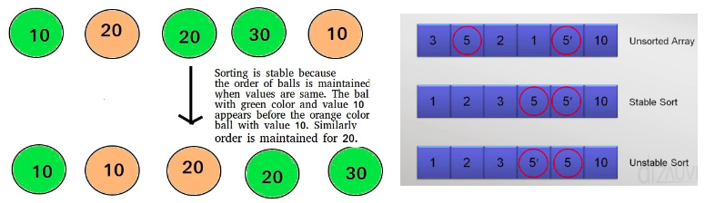

# Sorting Algorithms

## Sorting Definitions

### - In-place Sorting

   - **in-place sort**: if array is sorted in itself.
   - **not in-place sort**: if array is sorted in another array.  


### - Stability

   - **stable sort**: elements in the unsorted array appear at their same order in the sorted array.
   
   
   
## Bubble Sort

In Bubble sort, Each element of the array is compared with its adjacent element.

#### How it works?


#### Pseudo Code

```
for i = 0 to n
   for j = 0 to n-i
      if arr[j] > arr[j+1]
         swap
```

#### Analysis

- **O(n<sup>2</sup>)**

#### Code improvement

```
isSwapped = true   
i = 0
while isSwapped       
   isSwapped = false
   for j = 0 to n-i
      if arr[j] > arr[j+1]
         swap
         isSwapped = true
   i++
```

##### Worst Case:
- Sorted in reversed order.
- **O(n<sup>2</sup>)**

##### Best Case:
- Sorted in correct order
- **O(n)**

#### Properties

- Time Complexity: **O(n<sup>2</sup>)**
   - Best Case: **O(n)**
   - Worst Case: **O(n<sup>2</sup>)**
- Space Complexity: **O(1)**
- In-place
- Stable

#### Implementation

```js
const bubbleSort = arr => {
     let isSwapped = true;
     let i = 0;
     while (isSwapped) {
         isSwapped = false;
         for (let j = 0; j < arr.length - i - 1; j++) {
             if (arr[j] > arr[j+1]) {
                 // swap
                 let temp = arr[j];
                 arr[j] = arr[j+1];
                 arr[j+1] = temp;
                 isSwapped = true;
             }
         }
         i++;
     }
     return arr;
  }
 
  bubbleSort([5,1,4,2,8]); // [1,2,4,5,8]
 
  bubbleSort([1,2,4,5,8]); // [1,2,4,5,8]
 
  bubbleSort([8,5,4,2,1]); // [1,2,4,5,8]
```

## Selection Sort

In selection sort, the smallest value among the unsorted elements of the array is selected in every pass and inserted to its appropriate position into the array.

First, find the smallest element of the array and place it on the first position. Then, find the second smallest element of the array and place it on the second position. The process continues until we get the sorted array.

#### How it works?


#### Pseudo Code

```
for i = 0 to n-1
   find the smallest element from i to n
   swap with the i<sup>th</sup> element
```

#### Analysis
- **O(n<sup>2</sup>)**

#### Properties

- Time Complexity: **O(n<sup>2</sup>)**
- Space Complexity: **O(1)**
- In-place
- Stable

#### Implementation

```js
const selectionSort = arr => {
     for (let i = 0; i < arr.length; i++) {
         let min = i;
         for (let j = i + 1; j < arr.length ; j++) {
             if (arr[j] < arr[min]) {
                 min = j;
             }
         }
         if (min !== i ) {
             let temp = arr[min];
             arr[min] = arr[i];
             arr[i] = temp;
         }
     }
     return arr;
  }
 
  selectionSort([7,4,5,9,8,2,1]); // [1,2,4,5,7,8,9]
```

## Insertion Sort

Insertion sort is a simple sorting algorithm that works similar to the way you sort playing cards in your hands. The array is virtually split into a sorted and an unsorted part. Values from the unsorted part are picked and placed at the correct position in the sorted part.

#### How it works?

1. Iterate from arr[1] to arr[n] over the array.
2: Compare the current element (key) to its predecessor.
3: If the key element is smaller than its predecessor, compare it to the elements before. Move the greater elements one position up to make space for the swapped element.


#### Pseudo Code

```
for i = 1 to n         
	    k = arr[i]      
	    j = i-1          
	    while j >= 0 && arr[j] > k  
	       arr[j+1] = arr[j]  
		  j--
	    arr[j+1] = k 
```

#### Analysis

##### Worst Case:
- reversely sorted
- **O(n<sup>2</sup>)**

##### Best Case:
- sorted
- **O(n)**

#### Properties

- Time Complexity:
   - Best Case: **O(n)**
   - Worst Case: **O(n<sup>2</sup>)**
- Space Complexity: **O(1)**
- In-place
- Stable

#### Implementation

```js
const insertionSort = arr => {
     for (let i = 1; i < arr.length; i++) {
         let k = arr[i];
         let j = i - 1;
         while (j >= 0 && arr[j] > k) {
             arr[j+1] = arr[j];
             j--;
         }
         arr[j+1] = k;
     }
     return arr;
  }
 
  insertionSort([9,7,6,15,17,5,10,11]); // [5,6,7,9,10,11,15,17]
```

## Bubble Sort VS Selection Sort VS Insertion Sort

- Bubble sort is simple.

- Insertion sort has best case when array is already sorted and takes less swaps.

- Selection sort may take less write operations.
