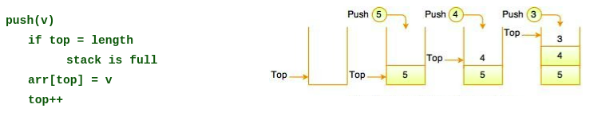
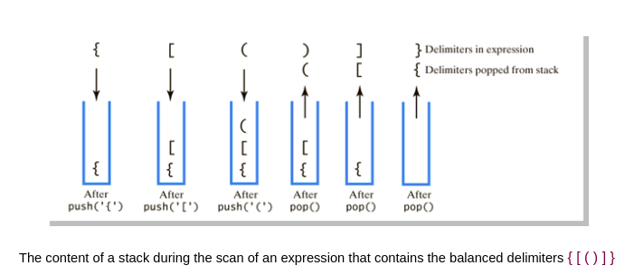
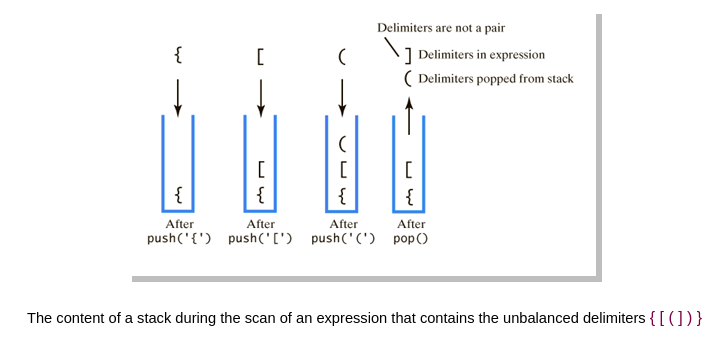
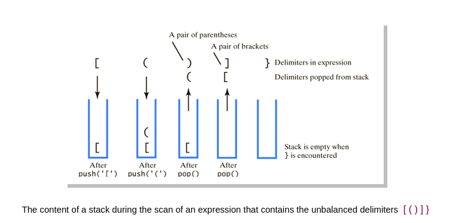
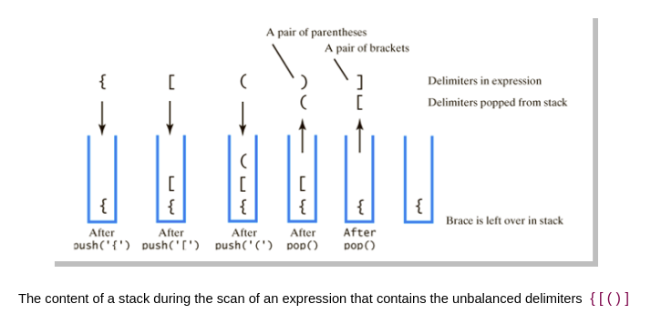
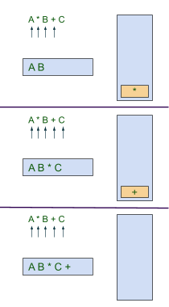
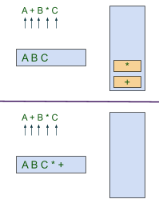
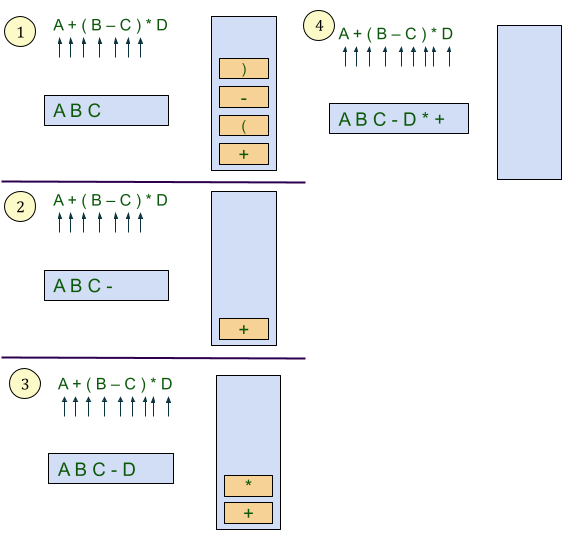
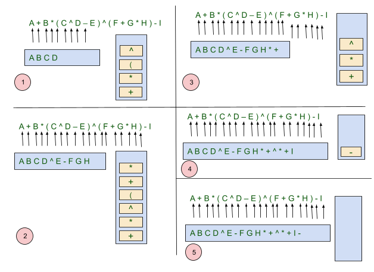
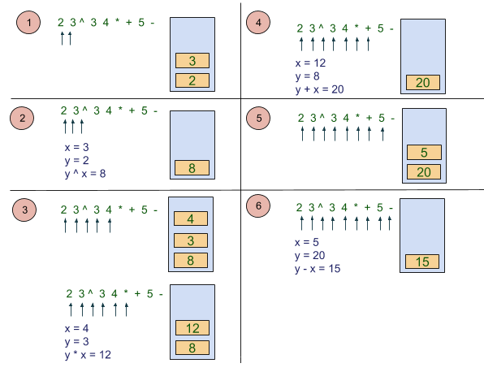

# Stack

## What is a Stack?

A Stack is a linear data structure that follows the **LIFO** (Last-In-First-Out) principle. It contains only one pointer pointing to the top element of the stack. Whenever an element is added in the stack, it is added on the top of the stack, and the element can be deleted only from the stack. 


There are many real-life examples of a stack. Consider an example of plates stacked over one another in the canteen. The plate which is at the top is the first one to be removed, i.e. the plate which has been placed at the bottommost position remains in the stack for the longest period of time. So, it can be simply seen to follow LIFO(Last In First Out).

Mainly the following three basic operations are performed in the stack:

- **push:** Insert an element in a stack. If the stack is full then the **overflow** condition occurs.
- **pop:** delete an element from the stack. If the stack is empty means that no element exists in the stack, this state is known as an **underflow** state.
- **Peek or Top:** Returns top element of stack.
- **isEmpty:** Returns ```true``` if stack is empty, else ```false```.

## Implement Stack using Array

### Push operation

Push operation involves following two steps:

- Add element at the position of top.
- Increment the variable ```Top``` so that it can now refere to the next memory location.

Stack is **overflown** when we try to insert an element into a completely filled stack therefore, our main function must always avoid **stack overflow condition**.



### Pop operation

Whenever an item is deleted from the stack, the top is decremented by ```1```, the operation returns the deleted value.

The **underflow** condition occurs when we try to delete an element from an already empty stack.

```
pop()
  if top = 0
    stack is empty
  top—
  return arr[top]
```

**Pros:** Easy to implement. Memory is saved as pointers are not involved. 
**Cons:** It is not dynamic. It doesn’t grow and shrink depending on needs at runtime.

## Implement Stack using Linked List

Instead of using array, we can also use linked list to implement stack. Linked list allocates the memory dynamically.

### Push operation

Pushing an element to a stack in linked list implementation is different from that of an array implementation. In order to push an element onto the stack, the following steps are involved.

- Create a node first and allocate memory to it.
- Then we have to add the new element in the beginning of the list (to not violate the property of the stack (LIFO)). For this purpose, assign the address of the starting element to the address field of the new node and make the new node, the starting node of the list.

###### Time Complexity : o(1)

```
push(v)
  list.addFirst(v)
```


### Pop Operation

In stack, the elements are popped only from one end, therefore, the value stored in the head pointer must be deleted and the node must be freed. The next node of the head node now becomes the head node.
 
```
pop()
  list.removeFirst()
```

**Pros:** The linked list implementation of stack can grow and shrink according to the needs at runtime. 
**Cons:** Requires extra memory due to involvement of pointers.

## Check for Balanced Brackets in an expression using Stack

**Balanced parentheses** means that each opening symbol has a corresponding closing symbol and the pairs of parentheses are properly nested. 

Consider the following correctly balanced strings of parentheses:

    (()()()())

    (((())))

    (()((())()))
    
Compare those with the following, which are not balanced:

    ((((((())

    ()))

    (()()(()

The ability to differentiate between parentheses that are correctly balanced and those that are unbalanced is an important part of recognizing many programming language structures.

The challenge then is to write an algorithm that will read a string of parentheses from left to right and decide whether the symbols are balanced. To solve this problem we need to make an important observation. As you process symbols from left to right, the most recent opening parenthesis must match the next closing symbol. Also, the first opening symbol processed may have to wait until the very last symbol for its match. Closing symbols match opening symbols in the reverse order of their appearance, they match from the inside out. This is a clue that stacks can be used to solve the problem.


Starting with an empty stack, process the parenthesis strings from left to right. If a symbol is an opening parenthesis, push it on the stack as a signal that a corresponding closing symbol needs to appear later. If, on the other hand, a symbol is a closing parenthesis, pop the stack. As long as it is possible to pop the stack to match every closing symbol, the parentheses remain balanced. If at any time there is no opening symbol on the stack to match a closing symbol, the string is not balanced properly. At the end of the string, when all symbols have been processed, the stack should be empty.

###### Examples









###### Algorithm

```
go throw parentheses
  if open
    push to stack
  if close
    if stack is empty or wrong close for top
      return not balance
    pop
if stack not empty
  return not balance
return balance
```

## Infix, Postfix and Prefix

- Infix expression:  ```x + y```
- Postfix expression:   ```x y +```
- Prefix expression:    ```+ x y```


### Infix to Postfix

Algorithm 

```
scan infix expression from left
if current is operand
   output it
else if current is operator
   if stack is empty || current is ‘(‘ || top is ‘(‘ || precedence(current) > precedence(top) 
      push(current)
   else if current is ‘)’
      pop until ‘(’
   else
      pop while prec(top) >= precedence(current)
      push current
when reach the end of infix expression
   if stack is not empty
      pop the remaining items
```

###### Examples

```A * B + C```



```A + B * C```



```A + (B - C) * D```



```A + B * ( C ^ D – E ) ^ ( F + G * H ) - I```



### Postfix Evaluation

Following is algorithm for evaluation postfix expressions.

1. Create a stack to store operands (or values).
2. Scan the given expression and do following for every scanned element.
    a. If the element is a number, push it into the stack
    b. If the element is a operator, pop operands for the operator from stack. Evaluate the operator and push the result back to the stack
3. When the expression is ended, the number in the stack is the final answer.

###### Example

```2  3 ^  3  4  *  +  5  -```



```scan postfix expression from left to right
if current is operand
   push to stack
else
   x = pop
   y = pop
   res = y op x
   push res to stack
when reach the end of postfix expression
   pop the result from the stack
```

