# Tree

## Basic terminology

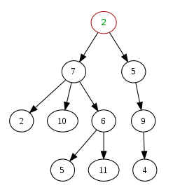

**Root**: first node in the tree. ```node 2```

**child**: branch of node. ```2, 10, 6 are children of 7```

**parent**: what branched from. ```6 is parent for 5, 11```

**ancestors**: parents to root

**leaves**: nodes has no children

**sub-tree**: part of tree makes tree

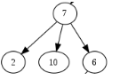

**height**: number of levels. ```3```

**depth**:number of levels from node to root. ```depth(6) = 2```

**siblings**: nodes that have the same parent

## Breadth First Traversal

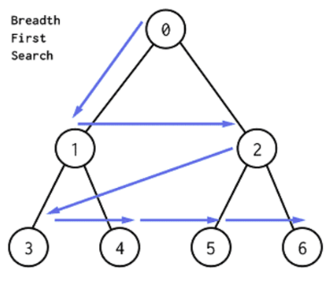

Breadth First Traversal proceeds level by level visiting all nodes on one level before moving on to the next. BFS starts traversal from the root node and visits nodes in a level by level manner.

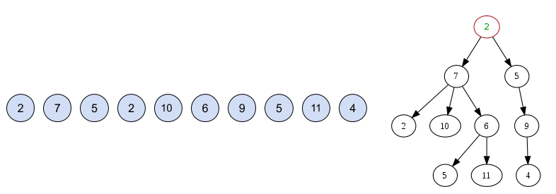

###### Algorithm:

```
q = new Queue
q.enqueue(root)
while q not empty
   front = q.dequeue()
   print front
   q.enqueue(front.children)
```

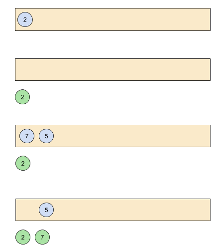

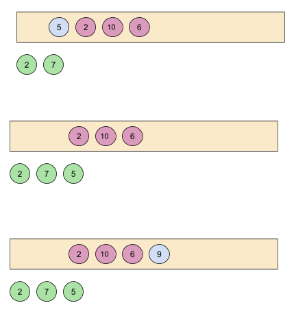

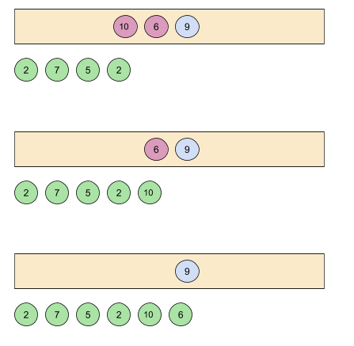

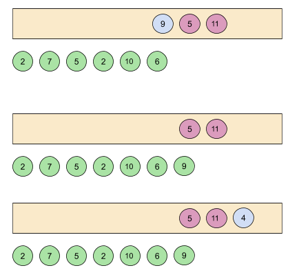

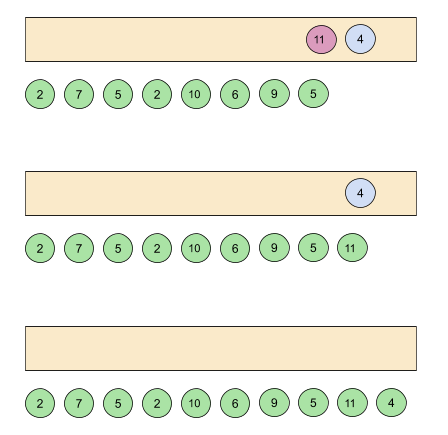

###### Time Complexity: O(n)

## Depth First Traversal


Depth First Traversal will follow a path from the starting node to an ending node, then another path from start to end until all the nodes are visited.

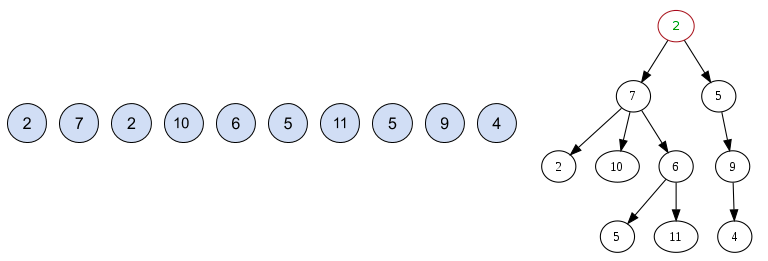

###### Algorithm:

```
s = new Stack()
print root
s.push(root)
while q not empty
c = pick unvisited child of s.top()
print c
s.push(c)
```

## Binary Tree

A tree whose elements have at most ```2``` children is called a binary tree. Since each element in a binary tree can have only ```2``` children, we typically name them the left and right child.

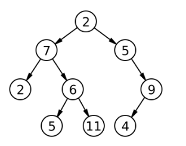

