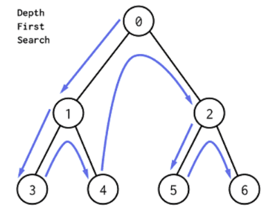

# Tree

## Basic terminology


**Root**: first node in the tree. ```node 2```

**child**: branch of node. ```2, 10, 6 are children of 7```

**parent**: what branched from. ```6 is parent for 5, 11```

**ancestors**: parents to root

**leaves**: nodes has no children

**sub-tree**: part of tree makes tree


**height**: number of levels. ```3```

**depth**:number of levels from node to root. ```depth(6) = 2```

**siblings**: nodes that have the same parent

## Breadth First Traversal


Breadth First Traversal proceeds level by level visiting all nodes on one level before moving on to the next. BFS starts traversal from the root node and visits nodes in a level by level manner.


###### Algorithm:

```
q = new Queue
q.enqueue(root)
while q not empty
   front = q.dequeue()
   print front
   q.enqueue(front.children)
```


###### Time Complexity: O(n)

## Depth First Traversal



Depth First Traversal will follow a path from the starting node to an ending node, then another path from start to end until all the nodes are visited.


###### Algorithm:

```
s = new Stack()
print root
s.push(root)
while q not empty
c = pick unvisited child of s.top()
print c
s.push(c)
```

## Binary Tree

A tree whose elements have at most ```2``` children is called a binary tree. Since each element in a binary tree can have only ```2``` children, we typically name them the left and right child.


### Binary Tree representation

There are two types of representation of a binary tree:

#### 1. Linked Representation

- In this representation, the binary tree is stored in the memory, in the form of a linked list where the number of nodes are stored at non-contiguous memory locations and linked together by inheriting parent child relationship like a tree.

- Every node contains three parts : 
   - pointer to the left node.
   - data element.
   - pointer to the right node. 
   
- Each binary tree has a root pointer which points to the root node of the binary tree. In an empty binary tree, the root pointer will point to ```null```.


In the above figure, a tree is seen as the collection of nodes where each node contains three parts : left pointer, data element and right pointer. Left pointer stores the address of the left child while the right pointer stores the address of the right child. The leaf node contains ```null``` in its left and right pointers.

#### 2. Sequential Representation

This is the simplest memory allocation technique to store the tree elements but it is an inefficient technique since it requires a lot of space to store the tree elements. A binary tree is shown in the following figure along with its memory allocation.


In this representation, an array is used to store the tree elements. Size of the array will be equal to the number of nodes present in the tree. The root node of the tree will be present at the 1<sup>st</sup> index of the array. If a node is stored at i<sup>th</sup> index then its left and right children will be stored at 2<sup>i</sup> and 2<sup>i</sup>+1 location. If the 1<sup>st</sup> index of the array i.e. tree[1] is ```0```, it means that the tree is empty.

### Insertion in a Binary Tree

The idea is to do Breadth First Traversal of the given tree. If we find a node whose left child is empty, we insert the new element as left child of the node. Else if we find a node whose right child is empty, we insert the new element as right child. We keep traversing the tree until we find a node whose either left or right is empty. 


After inserting ```5```:


### Deletion in a Binary Tree

1. Starting at root, find the deepest and rightmost node in binary tree and node which we want to delete. 
2. Replace the deepest rightmost node’s data with node to be deleted. 
3. Then delete the deepest rightmost node.


```
Find the deepest right most
replace with node wanted to be deleted
delete the deepest right most
```


